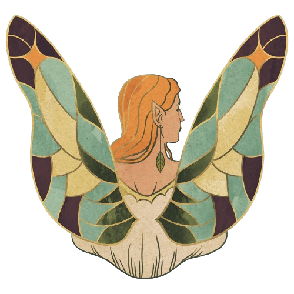

# Thriftopia

Thriftopia é uma plataforma para doações de roupas e acessórios, permitindo o cadastro de itens para doação. Este projeto foi desenvolvido como parte do módulo 2 da formação Programadores do Amanhã.

## Funcionalidades Principais

- Cadastro de Peças: Facilidade para adicionar itens de roupas e acessórios à plataforma.
- Atualização de Informações: Atualize facilmente os detalhes dos itens para manter a precisão das informações.
- Exclusão de Peças: Possibilidade de remover itens que já foram doados ou não estão mais disponíveis.
- Visualização de Itens: Explore as peças disponíveis para doação, com detalhes claros e fotos.
- Sistema de Filtros Avançados: Encontre exatamente o que procura com filtros por localização, descrição ou tamanho, tornando a busca mais eficiente e direcionada

## Tecnologias Utilizadas

- **Frontend:** React.js
- **Backend:** Node.js, Express.js
- **Banco de Dados:** MongoDB
- **Estilo:** CSS

## Como Usar

1. Clone o repositório para sua máquina local.
2. Instale as dependências do frontend e do backend utilizando o comando npm install.
3. Configure o MongoDB Atlas para armazenar os dados do aplicativo.
4. No arquivo .env do diretório server, adicione a URL de conexão do MongoDB Atlas seguindo o formato: MONGO_URL=sua_url_de_conexao.
5. Execute o servidor backend usando o comando npm start no diretório server.
6. Inicie o frontend executando o comando npm run dev no diretório client do projeto.
7. Abra o navegador e acesse o localhost para utilizar a página.

Agora você pode cadastrar, atualizar, excluir e visualizar peças cadastradas para doação na plataforma Thriftopia.

## Contribuição

Contribuições são bem-vindas! Sinta-se à vontade para abrir uma issue ou enviar um pull request.
